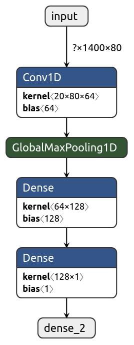

# Classification clean/noisy audio

Given mel-frequency spectogram predict whether audio is clean or noisy. Model was trained on [training data](https://drive.google.com/file/d/1M5oEPjOwxiMAVfVvUgMJ5yYOLyYq3tGz/view?usp=sharing) and evaluated on [validation data](https://drive.google.com/file/d/1Q7dhyYxFAV6EcWnVo3DtPymDhaiWiBda/view?usp=sharing). Task was solved by simple Keras model. Architecutre is below

